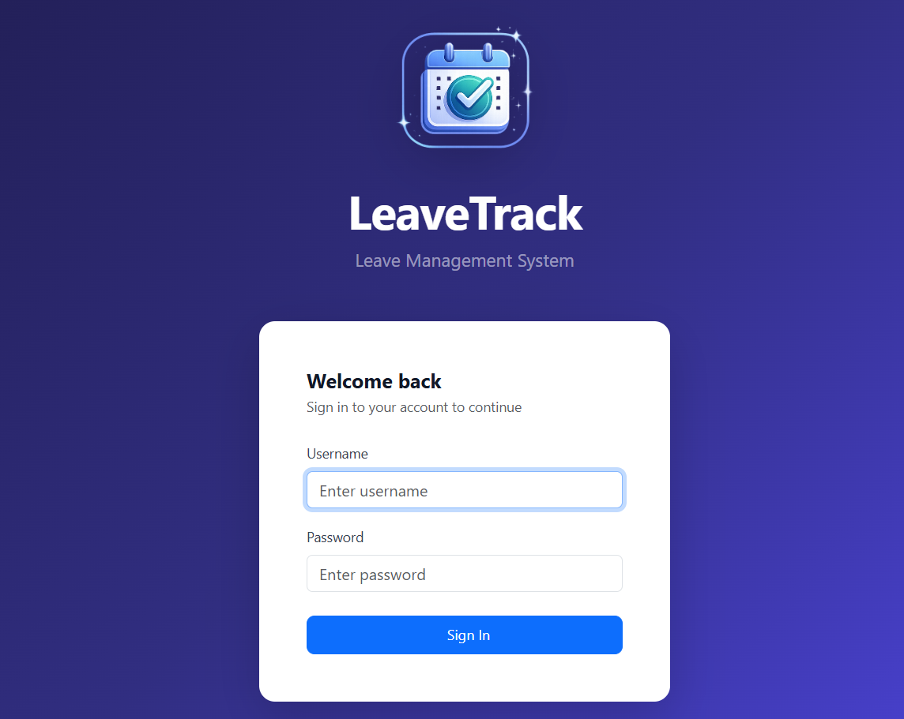
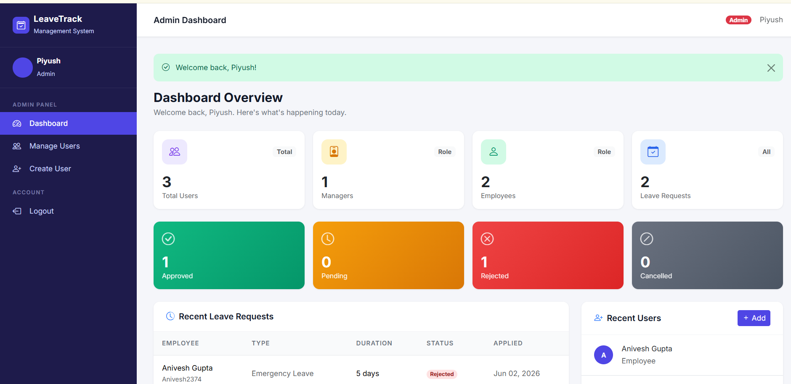
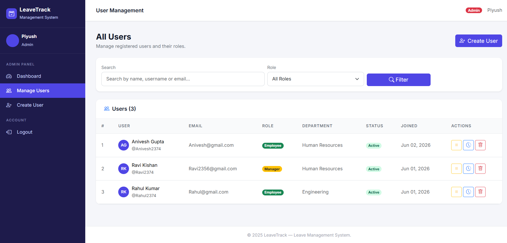
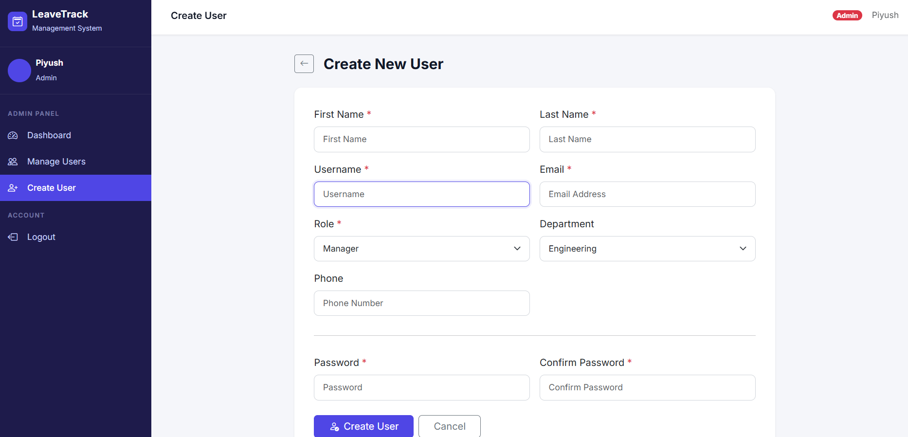
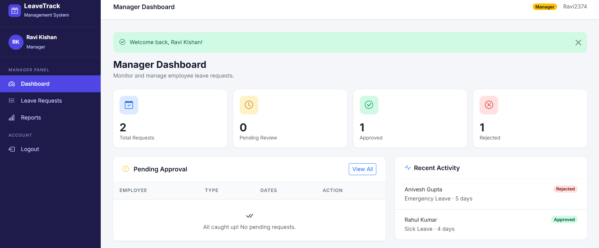
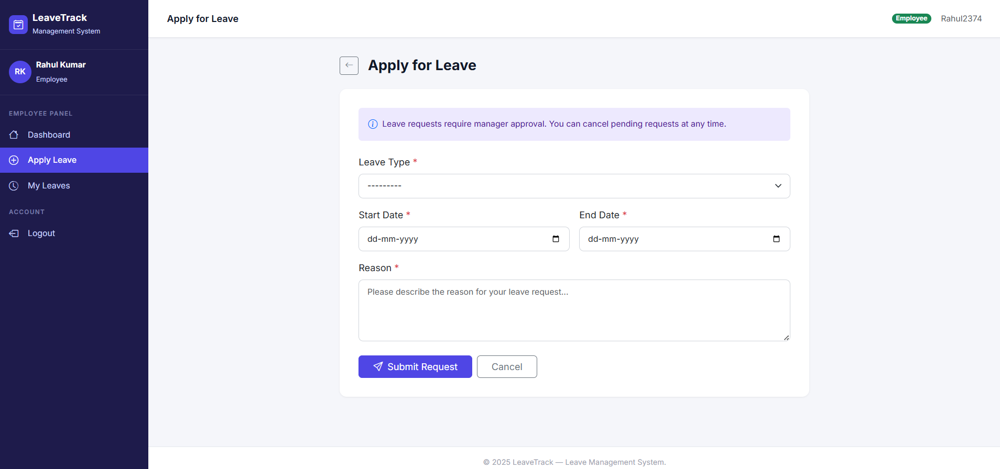
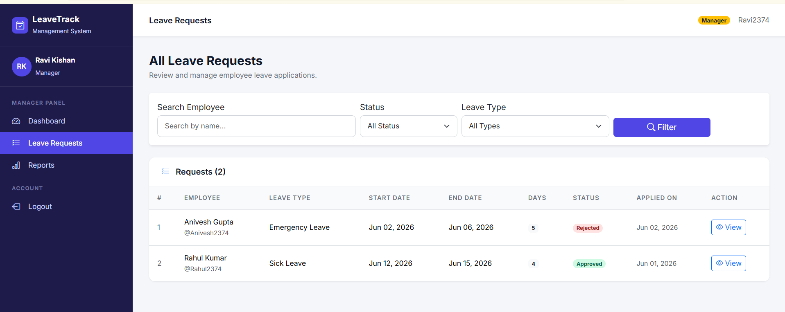
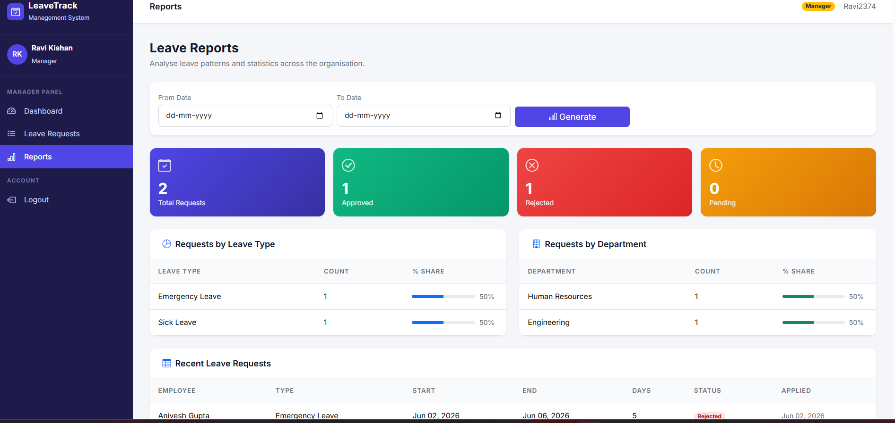
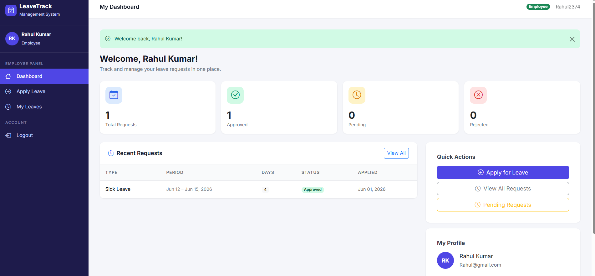

# 🚀 Leave Management System

A role-based Leave Management System built using Django and PostgreSQL. The application streamlines leave application, approval workflows, and employee management through dedicated dashboards for Admins, Managers, and Employees.

---

## 📌 Project Overview

The Leave Management System is a web-based application that automates the process of applying for, reviewing, approving, and tracking employee leave requests.

The system provides:

- Secure user authentication
- Role-based access control
- Employee leave application management
- Manager approval/rejection workflow
- Admin user management
- Dashboard analytics and reporting
- PostgreSQL-based permanent data storage

---

## 🛠️ Tech Stack

### Backend

- Python 3.x
- Django 5.x

### Frontend

- HTML5
- CSS3
- Bootstrap 5
- JavaScript

### Database

- PostgreSQL

### Version Control

- Git
- GitHub

---

## 👥 User Roles

### Admin

- Create users
- Manage user accounts
- Activate/Deactivate users
- Delete users
- View system statistics

### Manager

- View employee leave requests
- Approve leave requests
- Reject leave requests
- View employee leave history
- Access reports

### Employee

- Apply for leave
- View leave history
- Cancel pending leave requests
- Track leave status

---

## ✨ Features

### Authentication & Authorization

- Secure login system
- Role-based access control
- Custom access decorators
- Session management

### Leave Management

- Apply for leave
- Leave request tracking
- Leave approval workflow
- Leave cancellation

### User Management

- User creation
- User deletion
- Role assignment
- Account status management

### Dashboards

- Admin Dashboard
- Manager Dashboard
- Employee Dashboard

### Reporting

- Leave statistics
- Employee leave history
- Status-based reporting

---

## 📂 Project Structure

```text
leave_system/
│
├── leave_system/          # Project Configuration
│   ├── settings.py
│   ├── urls.py
│   ├── wsgi.py
│   └── asgi.py
│
├── leaveapp/              # Main Application
│   ├── models.py
│   ├── views.py
│   ├── forms.py
│   ├── decorators.py
│   ├── signals.py
│   ├── urls.py
│   └── migrations/
│
├── templates/
│   ├── admin/
│   ├── manager/
│   ├── employee/
│   ├── base.html
│   ├── base_auth.html
│   └── login.html
│
├── static/
│   ├── css/
│   ├── js/
│   └── images/
│
├── manage.py
└── requirements.txt
```

---

## 🗄️ Database Design

The application uses PostgreSQL for permanent data storage.

Major entities include:

- User
- Group (Admin, Manager, Employee)
- Leave Request
- Employee Profile

Relationships:

```text
User
 │
 ├── Employee Profile
 │
 └── Leave Requests

User
 │
 └── Group
       ├── Admin
       ├── Manager
       └── Employee
```

---

## ⚙️ Installation Guide

### Clone Repository

```bash
git clone https://github.com/YOUR_USERNAME/Leave-Management-System.git
cd Leave-Management-System
```

### Create Virtual Environment

```bash
python -m venv venv
```

### Activate Virtual Environment

Windows:

```bash
venv\Scripts\activate
```

Linux/Mac:

```bash
source venv/bin/activate
```

### Install Dependencies

```bash
pip install -r requirements.txt
```

---

## 🐘 PostgreSQL Configuration

Create a PostgreSQL database and update:

```python
DATABASES = {
    'default': {
        'ENGINE': 'django.db.backends.postgresql',
        'NAME': 'django_db',
        'USER': 'django_user',
        'PASSWORD': 'your_password',
        'HOST': 'localhost',
        'PORT': '5432',
    }
}
```

---

## 🔄 Run Migrations

```bash
python manage.py makemigrations
python manage.py migrate
```

---

## 👤 Create Superuser

```bash
python manage.py createsuperuser
```

---

## ▶️ Run Server

```bash
python manage.py runserver
```

Open:

```text
http://127.0.0.1:8000/
```

---

## 🔐 Authentication Flow

```text
Login
  ↓
Role Detection
  ↓
Dashboard Redirect

Admin    → Admin Dashboard
Manager  → Manager Dashboard
Employee → Employee Dashboard
```

---

## 🔄 Leave Workflow

```text
Employee
    ↓
Apply Leave
    ↓
Pending Request
    ↓
Manager Review
    ↓
Approved / Rejected
    ↓
Employee Notification
```

---

## 📊 Key Django Concepts Used

- Models
- Views
- Templates
- URL Routing
- Forms
- Signals
- Custom Decorators
- Authentication
- Authorization
- PostgreSQL Integration
- Static Files Management

---

## 🎯 Learning Outcomes

This project helped in understanding:

- Django Project Architecture
- Role-Based Access Control (RBAC)
- PostgreSQL Database Integration
- Template Inheritance
- Authentication and Authorization
- CRUD Operations
- Git and GitHub Workflow
- MVC/MVT Design Pattern

---

# 📸 Screenshots

## Login Page



## Admin Dashboard



## User Management



## Create User



## Manager Dashboard



## Apply Leave



## Leave Approval/Rejection



## Reports



## Employee Dashboard



## 🔮 Future Improvements

- Email Notifications
- Leave Balance Tracking
- Profile Management
- Department Management
- Calendar Integration
- Export Reports to PDF/Excel
- REST API Integration
- Deployment on Cloud

---

## 👨‍💻 Author

Piyush Kumar

Project – Leave Management System

Built using Django, PostgreSQL, Bootstrap, HTML, CSS, and JavaScript.

---

## 📜 License

This project is developed for educational purposes.
